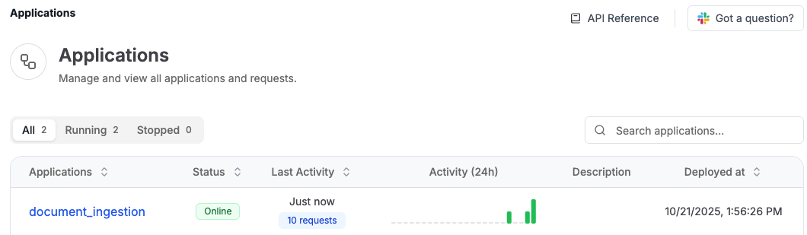

# Databricks + Tensorlake Integration Examples

<p align="center">
  
  
</p>
<p align="center">
  <a href="https://docs.tensorlake.ai"></a>
  
</p>

## Transform Unstructured Data into Queryable and AI Ready Data on Databricks

[Databricks](https://www.databricks.com/) is a unified data analytics platform built on Apache Spark, designed for data engineering, machine learning, and analytics at scale. When combined with Tensorlake's document parsing and serverless agentic application runtime, you can build AI workflows and agents which can automate processing of documents and other forms of unstructured data and land them in Databricks.

This repository demonstrates building a full ingestion pipeline on Tensorlake. The orchestration of your ingestion pipeline happens on Tensorlake, so you can write a distributed and durable ingestion pipeline in pure Python and Tensorlake will automatically queue requests as they arrive and scale the cluster to process data. The platform is serverless, so you only pay for compute resources used for processing data.

## Table of Contents
- [SEC Filings Analysis Pipeline](#sec-filings-analysis-pipeline)
- [Quick Start](#quick-start)
- [Local Testing](#local-testing)
- [Deploying to Tensorlake Cloud](#deploying-to-tensorlake-cloud)
- [Example Queries](#example-queries)
- [Quick Overview: Tensorlake Applications](#quick-overview-tensorlake-applications)
- [Why This Integration Matters](#why-this-integration-matters)
- [Resources](#resources)

## SEC Filings Analysis Pipeline

This repository demonstrates how to use Tensorlake Applications to extract AI-related risk mentions from SEC filings, storing and querying results in Databricks.

The Tensorlake Application receives Document URLs over HTTP, uses Vision Language Models to classify pages containing risk factors, calls an LLM for structured extraction from only relevant pages, and then uses Databricks SQL Connector to write structured data into your Databricks SQL Warehouse. Once it's inside Databricks you can run complex analytics to track trends, compare companies, and discover emerging risk patterns.

The Application is written in Python, without any external orchestration engines, so you can build and test it like any other normal application. You can use any document AI API in the Application, or even run open source VLM models on GPUs by annotating functions with GPU enabled hardware resources.

Tensorlake automatically queues requests and scales out the cluster, there is no extra configuration required for handling spiky ingestion.

**Key Features:**
- **Page Classification with VLMs**: Reduces processing from ~200 pages to ~20 relevant pages per document
- **Structured Extraction**: Extracts AI risk categories, descriptions, and severity indicators using Pydantic schemas
- **Parallel Processing**: Uses `.map()` to process multiple documents simultaneously
- **Dual Table Design**: Summary table for aggregations, detailed table for deep analysis
- **Pre-built Queries**: 6 analytics queries for risk distribution, trends, and company comparisons

## Architecture

```
Document URLs → Tensorlake Application → Page Classification (VLM)
                                      → Structured Extraction (LLM)
                                      → Databricks SQL Warehouse
                                      → SQL Analytics & Dashboards
```

The architecture separates document processing from querying:
- **Processing Application**: Handles ingestion, classification, extraction, and loading
- **Query Application**: Provides pre-built analytics queries as an API

Both applications are deployed as serverless functions and can be called via HTTP or programmatically.

## Quick Start

### Prerequisites

- Python 3.11+
- [Tensorlake API Key](https://docs.tensorlake.ai/platform/authentication#api-keys)
- Databricks SQL Warehouse credentials:
  - Server Hostname
  - HTTP Path
  - Access Token

### Databricks Setup

You need access to a Databricks SQL Warehouse. Find your connection details in the Databricks workspace under **SQL Warehouses → Connection Details**.

## Local Testing

### 1. Clone and Install

```bash
git clone https://github.com/tensorlakeai/databricks
cd databricks
pip install --upgrade tensorlake databricks-sql-connector pandas pyarrow
```

### 2. Set Environment Variables

```bash
export TENSORLAKE_API_KEY=your_tensorlake_api_key
export DATABRICKS_SERVER_HOSTNAME=your_hostname
export DATABRICKS_HTTP_PATH=your_http_path
export DATABRICKS_ACCESS_TOKEN=your_access_token
```

> **Tip:** If you encounter SSL certificate issues on macOS or other environments, you can set:
> ```bash
> export DATABRICKS_SQL_CONNECTOR_VERIFY_SSL=false
> ```

### 3. Process a Test Filing

Run the processing script to extract data from a single test SEC filing:

```bash
python process-sec.py
```

### 4. Query the Data

Head into the Databricks SQL Editor and query the data using this sample query:
```sql
WITH ranked_risks AS (
    SELECT 
        company_name,
        ticker,
        risk_description,
        citation,
        LENGTH(risk_description) as description_length,
        ROW_NUMBER() OVER (PARTITION BY company_name ORDER BY LENGTH(risk_description) DESC) as rn
    FROM ai_risks
    WHERE risk_category = 'Operational'
)
SELECT 
    company_name,
    ticker,
    citation,
    risk_description,
    description_length
FROM ranked_risks
WHERE rn = 1
ORDER BY company_name
```


## Deploying to Tensorlake Cloud

### 1. Verify Tensorlake Connection

```bash
tensorlake whoami
```

### 2. Set Secrets

Store your credentials securely in Tensorlake:

```bash
tensorlake secrets set TENSORLAKE_API_KEY='your_key'
tensorlake secrets set DATABRICKS_SERVER_HOSTNAME='your_hostname'
tensorlake secrets set DATABRICKS_HTTP_PATH='your_path'
tensorlake secrets set DATABRICKS_ACCESS_TOKEN='your_token'
```

### 3. Verify Secrets

```bash
tensorlake secrets list
```

### 4. Deploy Applications

Deploy the processing application:

```bash
tensorlake deploy process-sec.py
```

Once your applications have been deployed, you should be able to see them in your Applications on [cloud.tensorlake.ai](https://cloud.tensorlake.ai):



### 5. Run the Full Pipeline

Process all SEC filings using the deployed application:

```bash
python process-sec-remote.py
```

## Quick Overview: Tensorlake Applications

Tensorlake Applications are Python programs that:
1. Run as serverless applications
2. Can be triggered by HTTP requests, message queues, or scheduled events
3. Can use any Python package or model
4. Can run on CPU or GPU
5. Automatically scale out based on load
6. Have built-in queuing and fault tolerance
7. Support function composition with `.map()` for parallel processing

## Why This Integration Matters

The integration between Tensorlake and Databricks provides several key benefits:

1. **Simplified ETL for Unstructured Data**: Convert documents, images, and other unstructured data into structured formats without complex orchestration like Apache Airflow or Prefect.
2. **Serverless Architecture**: No infrastructure management required - just write Python code and deploy.
3. **Automatic Scaling**: Handle varying loads without manual intervention or cluster configuration.
4. **GPU Support**: Run ML models and VLMs efficiently when needed for document classification or embedding generation.
5. **Databricks Integration**: Leverage Databricks' powerful analytics capabilities, Unity Catalog, and Delta Lake with properly structured data.
6. **Production Ready**: Built-in error handling, retries, and observability for enterprise workloads.

## Project Structure

```
databricks/
├── process-sec.py           # Main processing application
├── process-sec-remote.py    # Script to call deployed process app
├── databricks-query.png     # Screenshot of Databricks SQL query
├── deployed-applications.png # Screenshot of Tensorlake dashboard
├── LICENSE                  # MIT License
└── README.md                # This file
```

## Resources

- [Tensorlake Documentation](https://docs.tensorlake.ai)
- [Databricks Documentation](https://docs.databricks.com)
- [Tutorial: Query SEC Filings in Databricks](https://docs.tensorlake.ai/examples/tutorials/query-sec-filings-databricks)
- [Integration Guide](https://docs.tensorlake.ai/integrations/databricks)
- [Community Support](https://tlake.link/slack)

## License

This project is licensed under the MIT License - see the [LICENSE](LICENSE) file for details.

## Support

- 📖 [Documentation](https://docs.tensorlake.ai)
- 💬 [Community Slack](https://tlake.link/slack)
- 🐛 [Issue Tracker](https://github.com/tensorlakeai/databricks/issues)
- 📧 [Email Support](mailto:support@tensorlake.ai)